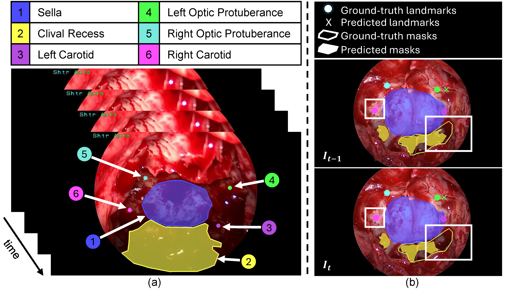
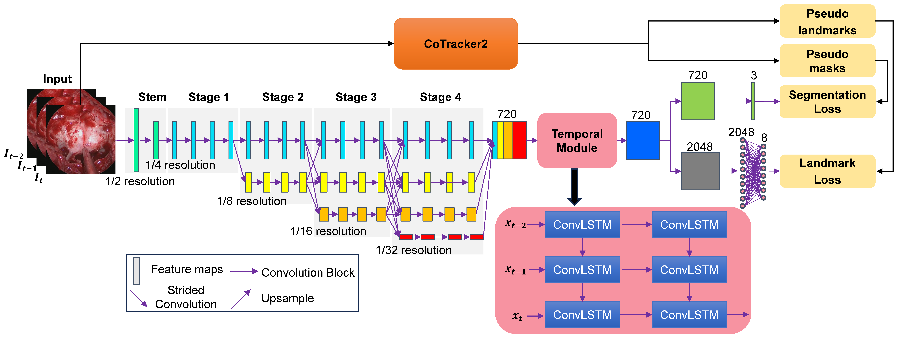
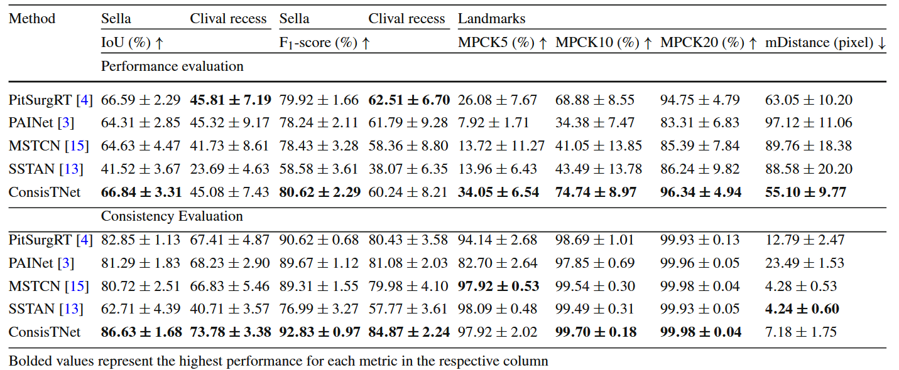
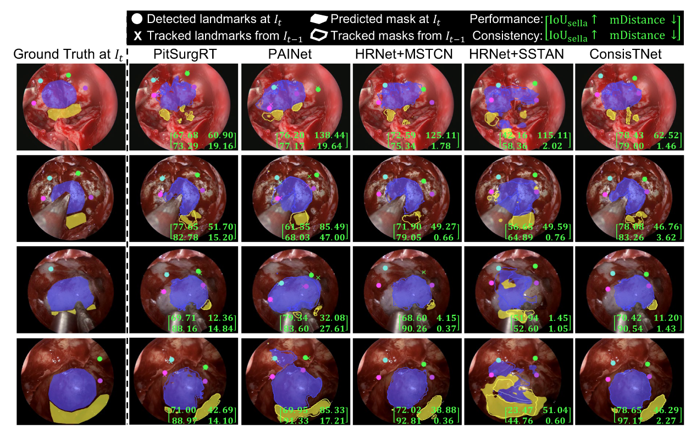

# ConsisTNet: A Spatio-Temporal Approach for Consistent Anatomical Localization in Endoscopic Pituitary Surgery

### [Paper](https://link.springer.com/article/10.1007/s11548-025-03369-2) | [BibTex](#citation)

## Abstract
Automated localization of critical anatomical structures in endoscopic pituitary surgery is crucial for enhancing patient safety and surgical outcomes. While deep learning models have shown promise in this task, their predictions often suffer from frame-to-frame inconsistency. This study addresses this issue by proposing ConsisTNet, a novel spatio-temporal model designed to improve prediction stability. ConsisTNet leverages spatio-temporal features extracted from consecutive frames to provide both temporally and spatially consistent predictions, addressing the limitations of single-frame approaches. We employ a semi-supervised strategy, utilizing ground-truth label tracking for pseudo-label generation through label propagation. Consistency is assessed by comparing predictions across consecutive frames using predicted label tracking. The model is optimized and accelerated using TensorRT for realtime intraoperative guidance. Compared to previous state-of-the-art models, ConsisTNet significantly improves prediction consistency across video frames while maintaining high accuracy in segmentation and landmark detection. Specifically, segmentation consistency is improved by 4.56\% and 9.45\% in IoU for the two segmentation regions, and landmark detection consistency is enhanced with a 43.86\% reduction in mean distance error. The accelerated model achieves an inference speed of 202 frames per second (FPS) with 16-bit floating point (FP16) precision, enabling realtime intraoperative guidance.  ConsisTNet demonstrates significant improvements in spatio-temporal consistency of anatomical localization during endoscopic pituitary surgery, providing more stable and reliable realtime surgical assistance.

## Limitation of Existing Methods
<div align="center">
  
  <p> (a) Temporal sequence of critical anatomical structures during the sellar phase of eTSA. (b) An example of prediction inconsistency (from <a href="https://doi.org/10.1007/s11548-024-03094-2">PitSurgRT</a>) between video frame I<sub>t-1</sub> and I<sub>t</sub>, with inconsistent predictions highlighted by white boxes.</p>
</div>

## Contributions
* A novel network architecture, ConsisTNet, that integrates spatio-temporal information to reduce prediction volatility during eTSA.
* A pseudo-label generation method based on CoTracker2 for temporal learning and consistency evaluation in the absence of ground truth data.
* A detailed analysis of the impact of temporal learning on reducing prediction variability in pituitary surgical video sequences.
* A real-time implementation of ConsisTNet to meet the performance requirements of intraoperative guidance.

## Architecture
<div align="center">
  
  <p>ConsisTNet architecture includes: a HRNet backbone; a temporal module; and dual heads. CoTracker2-generated pseudo-labels are utilized during training to enhance spatio-temporal learning.</p>
</div>

## Implementation and running
The proposed method is implemented using PyTorch 1.12.0 on Python 3.8.17.

To install Pytorch, please refer to [Pytorch](https://pytorch.org/).

In our experiments, we install the following Pytorch version for GPU : 
```
pip install torch==1.12.0+cu116 torchvision==0.13.0+cu116 torchaudio==0.12.0 --extra-index-url https://download.pytorch.org/whl/cu116
``` 
'PituVideo_train_val.py' script is used to run the training and validation process.

'PituVideo_test_consist_eval.py' script is used to evaluate consistency.

## Results
### Performance and consistency evaluation (mean ± std, fivefold cross-validation)
<div align="center">
  
</div>

### Qualitative Evaluation
<div align="center">
  
  <p>Qualitative comparison of prediction performance and consistency between the proposed and compared methods. The IoU for the focused area, sella, is displayed in the bottom right of each image.</p>
</div>

<!-- ---------------------------------------------- -->
## Citation
If any part of our paper and repository is helpful to your work, please generously cite with:
```
@article{mao2025consistnet,
  title={ConsisTNet: a spatio-temporal approach for consistent anatomical localization in endoscopic pituitary surgery},
  author={Mao, Zhehua and Das, Adrito and Khan, Danyal Z and Williams, Simon C and Hanrahan, John G and Stoyanov, Danail and Marcus, Hani J and Bano, Sophia},
  journal={International Journal of Computer Assisted Radiology and Surgery},
  pages={1--10},
  year={2025},
  publisher={Springer}
}
```

## Acknowledgement

This repo is largely based on [HRNet-Semantic-Segmentation](https://github.com/HRNet/HRNet-Semantic-Segmentation) and [CoTracker](https://github.com/facebookresearch/co-tracker). Thanks for their excellent work.

## Contact
If you have any questions or suggestions about this paper, feel free to contact me (z.mao@ucl.ac.uk).
